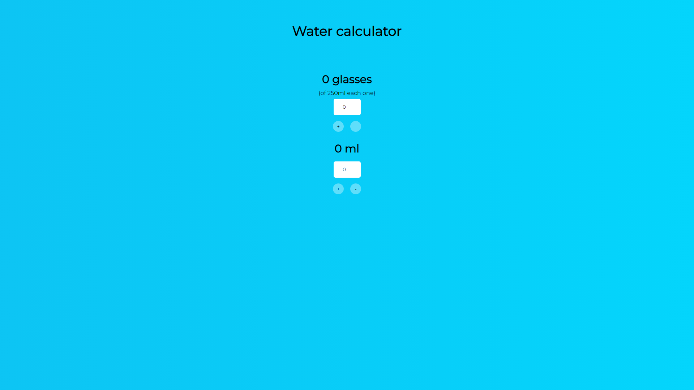

# Water calculator

The Water calculator proyect, is a React App, where you can make some easy calculations with water.

## Visuals

[

## Installation
1. Use [git](https://git-scm.com/) to instal the repo
1. Use the package manager [npm](https://docs.npmjs.com/) to install the Water calculator packages.
```bash
npm install
```
3. Run 
```bash
npm start
```

## Project status
Acctually, the proyect is abandonaded, but you can always contribute or make changes (see the liscene in "LICENSE.txt")


## Contributing

Pull requests are welcome. For major changes, please open an issue first
to discuss what you would like to change.

## License
[MIT](https://github.com/santisoifer/water-calculator/blob/main/LICENSE.txt)